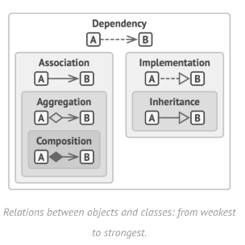

| Concept        | Purpose                                         | Usage                                                                                                       | Example                                                                                               |
|----------------|-------------------------------------------------|-------------------------------------------------------------------------------------------------------------|-------------------------------------------------------------------------------------------------------|
| Association    | To describe relationships between objects       | Use attributes or methods to connect objects                                                                | The `Person` class and the `Address` class have a relationship through the `address` attribute.       |
| Aggregation    | To represent a whole-part relationship          | Use attributes to represent the whole object and its parts. Parts can exist independently.                  | The `Library` class aggregates many `Book` objects, and each `Book` can exist independently.          |
| Composition    | To represent a stronger whole-part relationship | Use attributes to represent the whole object and its parts. The whole object strongly depends on the parts. | The `Car` class contains the `Engine` class, and a `Car` cannot exist without an `Engine`.            |
| Implementation | To implement an interface (interface)           | The implementing class provides definitions for all the methods in the interface.                           | The `Circle` class implements the `Shape` interface and implements the `area()` method.               |
| Inheritance    | To share and extend code                        | Subclasses inherit attributes and methods from the superclass.                                              | The `Animal` class is the superclass of the `Dog` class, and `Dog` inherits attributes from `Animal`. |
| Dependency     | To represent a usage relationship               | Use references or parameters to use another object.                                                         | The `Payment` class has a method that uses an object of the `Bank` class through a parameter.         |
