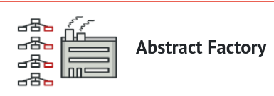
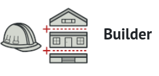
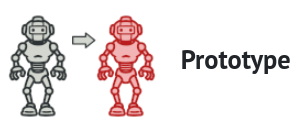

|  |  |  |  |  | 
|----------------------------------------------------|--------------------------------------------------------|--------------------------------------|------------------------------------------|------------------------------------------|

| Design Pattern                       | Definition                                                                                                                           | Purpose of Use                                                                          | How to Use                                                                                                                                                           |
|--------------------------------------|--------------------------------------------------------------------------------------------------------------------------------------|-----------------------------------------------------------------------------------------|----------------------------------------------------------------------------------------------------------------------------------------------------------------------|
| [Factory Method](factory-method)     | Provides an interface for creating objects in a superclass, but allows subclasses to alter the type of objects that will be created. | - Decouple from specific subclasses. - Easily extend by adding new subclasses.          | Define an interface or abstract class containing the Factory Method, then implement the Factory Method in the subclasses.                                            |
| [Abstract Factory](abstract-factory) | Provides an interface for creating families of related or dependent objects without specifying their concrete classes.               | - Maintain consistency among related objects.                                           | Define an interface or abstract class for the Abstract Factory, then implement this interface in concrete classes.                                                   |
| [Builder](builder)                   | Allows constructing a complex object step by step.                                                                                   | - Build objects with multiple attributes or options.                                    | Create a Builder class for the object to be constructed, define methods for setting attributes or options, and implement a build method for constructing the object. |
| [Prototype](prototype)               | Allows creating new objects by copying an existing object.                                                                           | - Create multiple copies of an object without recreating it from scratch.               | Define a copy method for object copying or implement the Cloneable interface (if available).                                                                         |
| [Singleton](singleton)               | Ensures that a class has only one instance and provides a global point of access to it.                                              | - Ensure only one instance of a class. - Share the instance throughout the application. | Implement the Singleton class by ensuring the constructor is private and providing a static method to access the Singleton instance.                                 |
