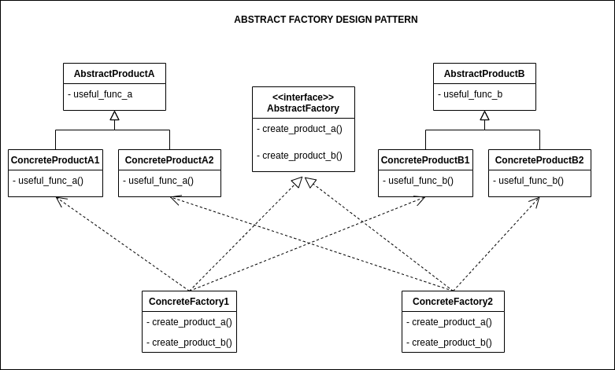

## Source

https://refactoring.guru/design-patterns/abstract-factory

### Important:

> 1. Abstract Factory is a creational design pattern that lets you produce families of related objects without
     specifying their concrete classes.
>
> 2. Creates an instance of several families of classes

## Description

## Structure



## How to use

1. Use the Abstract Factory when your code needs to work with various families of related products, but you don’t want
   it to depend on the concrete classes of those products—they might be unknown beforehand or you simply want to allow
   for future extensibility.
2. Consider implementing the Abstract Factory when you have a class with a set of Factory Methods that blur its primary
   responsibility.

## How to implement
https://refactoring.guru/design-patterns/abstract-factory#checklist
## Running

```
python main.py
python example.py
```