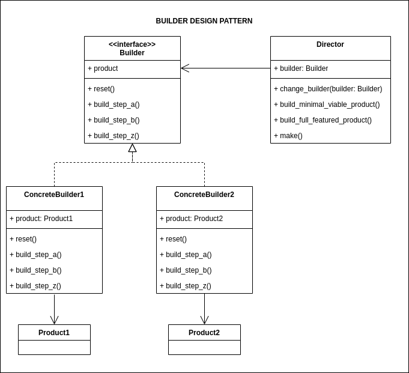

## Source

https://refactoring.guru/design-patterns/builder

## Cốt lõi:

> 

## Structure



Các bước tạo builder pattern chính:

1. 

## Description

### Mục đích

## Khi nào thì sử dụng builder pattern

1. 

## Running

```
python main.py
python example.py
```