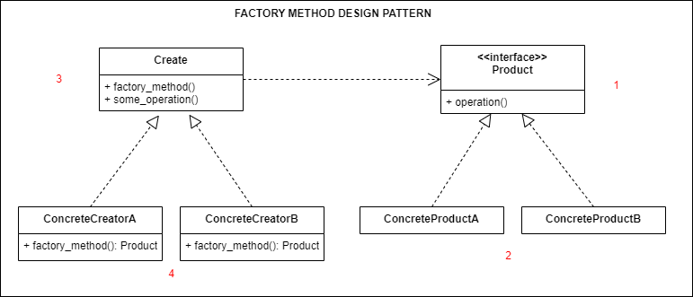

## Source
https://refactoring.guru/design-patterns/factory-method
### Important:
>Provides an interface for creating objects in a supper class, but allows subclasses to alter the type of objects that will be created
## Description

## Structure

## How to use
1. Use the Factory Method when you don’t know beforehand the exact types and dependencies of the objects your code should work with.
2. Use the Factory Method when you want to provide users of your library or framework with a way to extend its internal components.
3. Use the Factory Method when you want to save system resources by reusing existing objects instead of rebuilding them each time.
## Running
```
python main.py
python example.py
```

