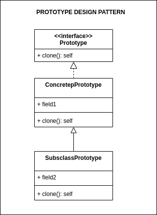

## Source

https://refactoring.guru/design-patterns/builder

## Cốt lõi:

> Builder là một mẫu thiết kế sáng tạo cho phép bạn xây dựng đối tượng phức tạp bước từng bước. Mẫu thiết kế này cho
> phép bạn tạo ra các loại và biểu diễn khác nhau của một đối tượng bằng cách sử dụng mã xây dựng chung.

## Structure



Các bước tạo prototype pattern chính:

1. **Xây dựng base class hoặc interface:** Đầu tiên, bạn cần xây dựng một base class hoặc interface mà các subclass hoặc
   cài đặt interface sẽ kế thừa. Base class này thường chứa một phương thức để sao chép chính nó.
2. **Triển khai phương thức sao chép (clone):**Trong base class hoặc interface, bạn cần triển khai một phương thức để sao
   chép chính nó. Phương thức này sẽ tạo ra một bản sao mới của đối tượng hiện tại và trả về nó.
3. **Tạo các subclass hoặc đối tượng cài đặt interface:** Bây giờ bạn có thể tạo các lớp con hoặc đối tượng cài đặt
   interface. Mỗi lớp con hoặc đối tượng cài đặt interface sẽ triển khai phương thức sao chép để tạo ra bản sao của
   chính nó.
4. **Sử dụng thực hiện prototype:**Khi bạn muốn tạo một đối tượng mới, thay vì tạo mới từ đầu, bạn sẽ gọi phương thức sao
   chép trên một đối tượng đã tồn tại của lớp gốc hoặc đối tượng gốc (prototype). Điều này sẽ tạo ra một bản sao mới của
   đối tượng và trả về nó.
5. **Tùy chỉnh đối tượng sao chép (tuỳ chọn):** Nếu cần, sau khi tạo ra bản sao, bạn có thể tùy chỉnh nó bằng cách thay đổi
   các thuộc tính hoặc trạng thái theo nhu cầu của bạn.

## Description

### Mục đích

Mục đích chính của việc sử dụng prototype trong design pattern là tạo ra các đối tượng mới bằng cách sao chép một đối
tượng hiện có (gốc) thay vì tạo mới từ đầu. Điều này giúp tối ưu hóa việc tạo đối tượng và giảm tải hệ thống khi cần tạo
nhiều đối tượng tương tự. Các mục đích cụ thể của việc sử dụng prototype trong design pattern bao gồm:

1. **Giảm tải hệ thống:** Thay vì tạo mới các đối tượng từ đầu mỗi lần cần, bạn có thể sử dụng một đối tượng prototype
   làm mẫu và sao chép nó để tạo ra các đối tượng mới. Điều này giúp giảm tải hệ thống và tối ưu hóa việc sử dụng tài
   nguyên, đặc biệt là khi bạn cần tạo nhiều đối tượng giống nhau.
2. **Đảm bảo tính nhất quán:** Prototype pattern đảm bảo tính nhất quán giữa các đối tượng được tạo ra, vì chúng được
   sao chép từ một đối tượng mẫu đã được thiết lập ban đầu. Điều này đặc biệt hữu ích khi bạn muốn đảm bảo rằng các đối
   tượng mới có các thuộc tính và trạng thái ban đầu giống nhau.

3. **Giảm phức tạp trong việc khởi tạo:** Nếu việc khởi tạo một đối tượng mới rất phức tạp hoặc tốn thời gian, bạn có
   thể sử dụng prototype để tránh việc lặp lại quá trình này. Bạn chỉ cần sao chép một đối tượng đã có sẵn và sau đó
   chỉnh sửa các thuộc tính cần thiết.

4. **Hỗ trợ việc tạo đối tượng đa dạng:** Prototype cho phép bạn tạo ra các biến thể của đối tượng mẫu bằng cách sao
   chép và tùy chỉnh chúng theo nhu cầu. Điều này giúp bạn xây dựng các đối tượng có tính đa dạng mà không cần phải triển khai
   nhiều lớp con.

5. **Tăng hiệu suất:** Bằng cách sử dụng prototype, bạn có thể tạo các đối tượng mới nhanh chóng bằng cách sao chép một
   đối tượng đã có, giúp tăng hiệu suất của ứng dụng.

Tóm lại, prototype pattern giúp tối ưu hóa việc tạo đối tượng, đảm bảo tính nhất quán và hỗ trợ việc tạo đối tượng đa
dạng trong các hệ thống phức tạp.

## Khi nào thì sử dụng prototype pattern

Prototype pattern thường được sử dụng trong các tình huống sau khi đáp ứng một số điều kiện cụ thể:

1. **Khi việc tạo đối tượng mới tốn kém:** Prototype pattern thường được sử dụng khi việc khởi tạo một đối tượng mới có
   thể tốn nhiều tài nguyên hoặc thời gian, chẳng hạn như khi cần thiết phải đọc dữ liệu từ cơ sở dữ liệu hoặc tải tài
   liệu từ mạng. Thay vì làm điều này mỗi lần cần một đối tượng mới, bạn có thể sao chép một đối tượng đã có sẵn để tạo
   các đối tượng mới.
2. **Khi cần tạo nhiều đối tượng giống nhau:** Prototype pattern hữu ích khi bạn cần tạo nhiều đối tượng có cùng cấu
   trúc và trạng thái ban đầu, chẳng hạn như trong trường hợp tạo ra nhiều sản phẩm trong một ứng dụng hoặc game.
3. **Khi bạn muốn tránh xây dựng nhiều lớp con:** Thay vì triển khai một lớp con cho mỗi biến thể của đối tượng, bạn có
   thể sử dụng prototype pattern để sao chép và tùy chỉnh các đối tượng theo cách cần thiết.
4. **Khi cần đảm bảo tính nhất quán giữa các đối tượng:** Prototype pattern đảm bảo rằng các đối tượng mới được tạo ra
   từ một mẫu ban đầu sẽ có các thuộc tính và trạng thái khởi đầu giống nhau. Điều này hữu ích khi bạn muốn đảm bảo tính
   nhất quán trong ứng dụng của mình.
5. **Khi bạn muốn tạo đối tượng một cách động tại thời điểm chạy (runtime):** Prototype pattern cho phép bạn tạo đối
   tượng một cách động tại thời điểm chạy dựa trên nhu cầu của ứng dụng mà không cần biết trước lúc chạy đối tượng cụ
   thể nào cần được tạo ra.
6. **Khi bạn muốn giảm tải hệ thống:** Prototype pattern giúp giảm tải hệ thống bằng cách tận dụng lại các đối tượng đã
   có sẵn thay vì tạo mới từ đầu, đặc biệt là trong các ứng dụng yêu cầu tạo nhiều đối tượng liên tục.

Tóm lại, bạn nên sử dụng prototype pattern khi cần tối ưu hóa việc tạo đối tượng, đảm bảo tính nhất quán và hỗ trợ việc
tạo đối tượng đa dạng trong các tình huống mà nó phù hợp.

## Running

```
python main.py
python example.py
```