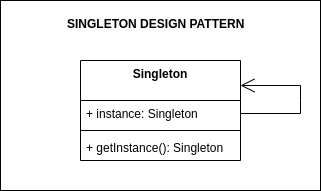

## Source

https://refactoring.guru/design-patterns/singleton

### Important:

> 1. Singleton is a creational design pattern that lets you ensure that a class has only one instance, while providing a
     global access point to this instance..
> 2. A class of which only a single instance can exist

## Description

## Structure



## How to use

1. Use the Singleton pattern when a class in your program should have just a single instance available to all clients;
   for example, a single database object shared by different parts of the program.
2. Use the Singleton pattern when you need stricter control over global variables.

## How to implement

https://refactoring.guru/design-patterns/singleton#checklist

## Running

```
python main.py
python example.py
```