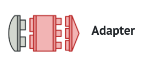
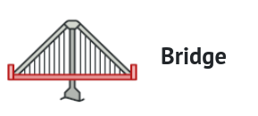
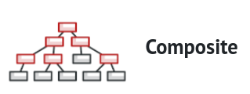
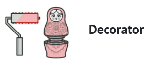
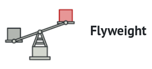
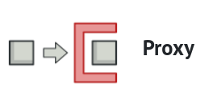

|  |  |  |  |  |  |  | 
|--------------------------------------|------------------------------------|------------------------------------------|------------------------------------------|------------------------------------|------------------------------------------|----------------------------------|

| Design Pattern                                   | Definition                                      | Purpose                                                      | How to Use                                                                                                     |
|--------------------------------------------------|-------------------------------------------------|--------------------------------------------------------------|----------------------------------------------------------------------------------------------------------------|
| [Adapter](structural-design-pattern/adapter)     | Allows incompatible interfaces to work together | Reuse or make two incompatible classes work together         | Create an adapter class that implements the desired interface and wraps an instance of the incompatible class. |
| [Bridge](structural-design-pattern/bridge)       | Separates abstraction from implementation       | Decouple abstraction and implementation                      | Create abstraction and implementation hierarchies and bridge them using composition.                           |
| [Composite](structural-design-pattern/composite) | Represents part-whole hierarchies               | Create a hierarchical structure of objects                   | Define a common interface for leaf and composite objects and implement the pattern using composition.          |
| [Decorator](structural-design-pattern/decorator) | Dynamically adds responsibilities               | Extend functionality of individual objects                   | Create decorator classes that wrap objects and add behavior.                                                   |
| [Facade](structural-design-pattern/facade)       | Provides a simplified interface to subsystems   | Simplify complex subsystem interactions                      | Create a facade class that encapsulates interactions with the subsystem.                                       |
| [Flyweight](structural-design-pattern/flyweight) | Shares common state among objects               | Efficiently support a large number of similar objects        | Identify intrinsic and extrinsic properties; create a factory to manage shared intrinsic properties.           |
| [Proxy](structural-design-pattern/proxy)         | Provides a surrogate or placeholder             | Control access, add functionality, or implement lazy loading | Create a proxy class that implements the same interface as the real object and forwards requests.              |
