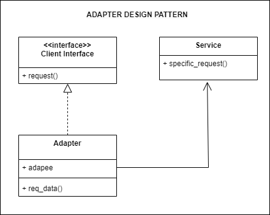

## Source

https://refactoring.guru/design-patterns/adapter

## Cốt lõi:

> Adapter là một mẫu thiết kế cấu trúc cho phép các đối tượng có interface không tương thích làm việc cùng nhau.

## Structure



Các bước tạo một adapter

1. **Xác định inteface mục tiêu (Target Interface):** Đầu tiên, bạn cần xác định interface mà client mong muốn sử dụng.
   Đây là interface mà Adapter sẽ triển khai để chuyển đổi interface không tương thích thành interface mục tiêu.
2. **Tạo lớp Adapter:** Tạo một lớp mới hoặc đối tượng mới (gọi là Adapter) và triển khai interface mục tiêu (Target
   Interface) trên lớp Adapter này. Lớp Adapter sẽ chứa một tham chiếu đến đối tượng có interface không tương thích mà
   bạn muốn tích hợp.
3. **Triển khai phương thức của interface mục tiêu**: Trong lớp Adapter, triển khai các phương thức của interface mục
   tiêu mà bạn đã xác định ở bước 1. Trong các phương thức này, bạn sẽ thực hiện việc gọi đến phương thức tương ứng của
   đối tượng có interface không tương thích.
4. **Tạo instance của Adapter:** Tạo một instance của lớp Adapter và cung cấp cho client. Instance này sẽ là cách client
   tương tác với đối tượng có interface không tương thích thông qua Adapter.
5. **Sử dụng Adapter:** Sử dụng instance của Adapter để gọi các phương thức của interface mục tiêu mà client mong muốn
   sử dụng. Adapter sẽ chuyển đổi yêu cầu từ client sang đối tượng có interface không tương thích và trả về kết quả cho
   client.
6. **Kiểm tra và điều chỉnh**: Kiểm tra và đảm bảo rằng Adapter hoạt động đúng cách. Điều chỉnh và sửa lỗi nếu cần
   thiết.

## Description

### Mục đích

Mục đích chính của mẫu thiết kế Adapter là chuyển đổi interface của một lớp hoặc đối tượng thành một interface khác mà
client mong muốn sử dụng. Mẫu thiết kế Adapter được sử dụng để giải quyết các vấn đề sau:

1. **Tích hợp hệ thống:** Khi bạn có hai phần mềm hoặc các thành phần được phát triển riêng biệt và chúng có interface
   không
   tương thích, bạn có thể sử dụng Adapter để kết nối chúng lại với nhau mà không cần thay đổi mã nguồn gốc.
2. **Tích hợp các thư viện và framework bên ngoài:** Adapter cho phép bạn sử dụng các thư viện hoặc framework bên ngoài
   mà
   không cần sửa đổi mã nguồn của ứng dụng của mình để phù hợp với interface của chúng.
3. **Tạo interface thụ động:** Adapter cung cấp một cách để tạo một interface mới để thực hiện một số hoạt động hoặc
   tính
   năng mà bạn muốn sử dụng trong ứng dụng của mình mà không cần thay đổi mã nguồn gốc của đối tượng.
4. **Tái sử dụng mã nguồn:** Adapter giúp bạn tái sử dụng mã nguồn hiện có bằng cách đóng gói lớp hoặc đối tượng có
   interface không phù hợp trong một Adapter mới, và sau đó sử dụng Adapter này trong ứng dụng của mình.
5. **Giảm sự phụ thuộc:** Adapter giúp giảm sự phụ thuộc giữa các thành phần trong hệ thống bằng cách tạo một lớp trung
   gian
   để chuyển đổi giữa các interface không tương thích.

Mẫu thiết kế Adapter giúp cải thiện khả năng tái sử dụng, bảo trì và mở rộng ứng dụng bằng cách cho phép tích hợp các
thành phần hoặc dịch vụ từ các nguồn khác nhau mà không làm thay đổi mã nguồn hiện có quá nhiều.

## Khi nào thì sử dụng adapter

1. **Khi bạn muốn sử dụng một lớp hoặc đối tượng có interface không tương thích với các thành phần hiện có**:
    - Ví dụ: Bạn có một lớp hoặc đối tượng được phát triển bởi một bên thứ ba và muốn tích hợp nó vào ứng dụng của mình.
      Tuy nhiên, interface của nó không phù hợp với các thành phần hiện có trong ứng dụng.

2. **Khi bạn muốn tích hợp các thư viện hoặc framework bên ngoài vào ứng dụng của mình**:
    - Ví dụ: Bạn muốn sử dụng một thư viện hoặc framework mới có interface không tương thích với cách mà ứng dụng của
      bạn đã được thiết kế.

3. **Khi bạn muốn tạo ra một interface thụ động mới cho một đối tượng hoặc lớp hiện có**:
    - Ví dụ: Bạn muốn mở rộng chức năng của một lớp hoặc đối tượng hiện có mà không muốn thay đổi mã nguồn của nó trực
      tiếp.

4. **Khi bạn muốn tái sử dụng mã nguồn đã có**:
    - Ví dụ: Bạn có một số mã nguồn hoặc thư viện có interface không phù hợp với môi trường hoặc cấu trúc của ứng dụng
      hiện tại.

5. **Khi bạn muốn giảm sự phụ thuộc giữa các thành phần trong hệ thống**:
    - Ví dụ: Bạn muốn đảm bảo rằng các thành phần trong hệ thống không phụ thuộc quá nhiều vào nhau bằng cách sử dụng
      một lớp trung gian để chuyển đổi giữa các interface không tương thích.

## Running

```
python main.py
python example.py
```