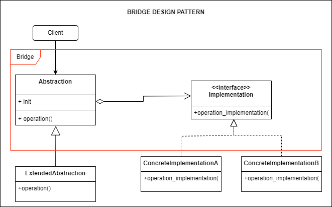

## Source

https://refactoring.guru/design-patterns/bridge

## Cốt lõi:

> Bridge là một mẫu thiết kế cấu trúc cho phép bạn chia một lớp lớn hoặc một tập hợp các lớp có liên quan mật thiết
> thành hai cấu trúc riêng biệt abstraction (trừu tượng) và implementation (thực hiện) có thể phát triển độc lập với
> nhau.

## Structure



Các bước tạo một bridge

1. Bước 1: Xác định các thành phần chính

- Xác định các thành phần trừu tượng (abstraction) và implementation mà bạn muốn tách rời.
- Xác định các chức năng hoặc phương thức cần thiết mà interface và implementation sẽ chia sẻ.

2. Bước 2: Tạo interface (abstraction)

- Định nghĩa một interface hoặc abstract class để đại diện cho thành phần trừu tượng.
- Interface này sẽ chứa các phương thức hoặc chức năng mà các lớp con sẽ triển khai.

3. Bước 3: Tạo implementation

- Định nghĩa một interface hoặc abstract class khác để đại diện cho implementation của thành phần.
- Định nghĩa các lớp implementation cụ thể (concrete implementation classes) mà sẽ triển khai interface này. Mỗi lớp này
  sẽ thực hiện các phương thức hoặc chức năng cụ thể cho một implementation nhất định.

4. Bước 4: Liên kết interface và implementation

- Trong interface trừu tượng, thêm field hoặc tham chiếu đến interface implementation. Điều này cho phép interface
  và implementation kết nối với nhau tại thời điểm chạy (runtime).

5. Bước 5: Triển khai các lớp con

- Tạo các lớp con (concrete classes) kế thừa từ abstract interface. Mỗi lớp con sẽ cung cấp triển khai cụ thể cho các
  phương thức hoặc chức năng của abstract interface.

6. Bước 6: Sử dụng Bridge Pattern

- Trong ứng dụng của bạn, sử dụng các đối tượng của các lớp con đã triển khai để thực hiện logic cụ thể. Interface trừu
  tượng sẽ đại diện cho thành phần trừu tượng, trong khi cài đặt cụ thể sẽ quản lý cách thức triển khai.

7. Bước 7: Cấu hình và gọi phương thức

- Tạo và cấu hình đối tượng abstract interface với một đối tượng cài đặt cụ thể. Sau đó, gọi các phương thức của
  abstract interface để thực hiện công việc.

8. Bước 8: Tùy chỉnh và mở rộng

- Bridge Pattern cho phép bạn dễ dàng tùy chỉnh và mở rộng bằng cách thêm mới lớp implementation cụ thể hoặc lớp con mà
  không làm thay đổi các thành phần hiện có.

## Description

### Mục đích

Mục đích chính của Bridge Design Pattern là tách biệt một thành phần trừu tượng (abstraction) ra khỏi implement (
implementation) của nó, để chúng có thể thay đổi độc lập và không ảnh hưởng đến nhau. Mô hình này thường được sử dụng
trong lập trình hướng đối tượng để giải quyết vấn đề khi bạn muốn có sự tách rời giữa interface và cách thức thực hiện.
Dưới đây là một số mục đích cụ thể của Bridge Design Pattern:

1. Tách rời interface (abstraction) và implementation: Bridge Pattern giúp tạo ra một interface (abstraction) và một
   implementation riêng biệt, cho phép chúng hoạt động độc lập. Điều này làm cho việc thay đổi interface hoặc
   implementation trở nên dễ dàng mà không cần sửa đổi code ở phía kia.
2. Khả năng mở rộng: Bridge Pattern cho phép bạn mở rộng cả interface và cài đặt một cách độc lập. Bạn có thể thêm mới
   các lớp interface hoặc implementation mà không ảnh hưởng đến các lớp khác.
3. Tích hợp khả năng đa kế thừa: Pattern này giúp giảm sự phụ thuộc vào đa kế thừa trong một số ngôn ngữ lập trình, như
   C++. Thay vì kế thừa từ nhiều lớp, bạn có thể sử dụng Bridge để quản lý các implementation riêng biệt.
4. Cải thiện độ bảo trì: Bridge Pattern làm cho việc bảo trì code dễ dàng hơn. Bạn có thể chỉnh sửa và bảo trì
   implementation và interface mà không ảnh hưởng đến nhau.
5. Giúp xây dựng các hệ thống linh hoạt: Với Bridge Pattern, bạn có thể xây dựng các hệ thống linh hoạt có khả năng thay
   đổi implementation và interface tùy ý, giúp ứng dụng dễ dàng thích ứng với các yêu cầu mới.

## Khi nào thì sử dụng bridge

1. Khi bạn muốn tách rời interface và implementation: Khi bạn có một thành phần trừu tượng (abstraction) và muốn có khả
   năng thay đổi implementation của nó mà không ảnh hưởng đến interface.
2. Khi bạn muốn tránh việc có một lớp con cho mỗi implementation: Thay vì sử dụng đa kế thừa hoặc tạo ra nhiều lớp con
   cho từng implementation, bạn có thể sử dụng Bridge Pattern để quản lý implementation riêng biệt và áp dụng chúng vào
   interface chung.
3. Khi bạn muốn có khả năng mở rộng: Nếu bạn cần thêm mới các lớp interface hoặc implementation mà không làm thay đổi
   code hiện có.
4. Khi bạn muốn giảm sự phụ thuộc vào kế thừa: Trong một số ngôn ngữ lập trình, đa kế thừa có thể gây ra vấn đề phức
   tạp. Bridge Pattern giúp giảm sự phụ thuộc này bằng cách tách rời interface và implementation.
5. Khi bạn cần xây dựng hệ thống linh hoạt: Nếu bạn muốn xây dựng một hệ thống có khả năng thay đổi interface và
   implementation theo nhu cầu mà không cần phải làm thay đổi quá nhiều code hiện có.

Ví dụ cụ thể có thể bao gồm quản lý các thiết bị đa phương tiện (ví dụ: TV, radio) và các chức năng điều khiển (ví dụ:
điều khiển từ xa) trong ứng dụng, nơi bạn muốn có khả năng thay đổi thiết bị và điều khiển mà không ảnh hưởng đến nhau.
Bridge Pattern sẽ giúp bạn làm điều này một cách hiệu quả.

## Running

```
python main.py
python example.py
```