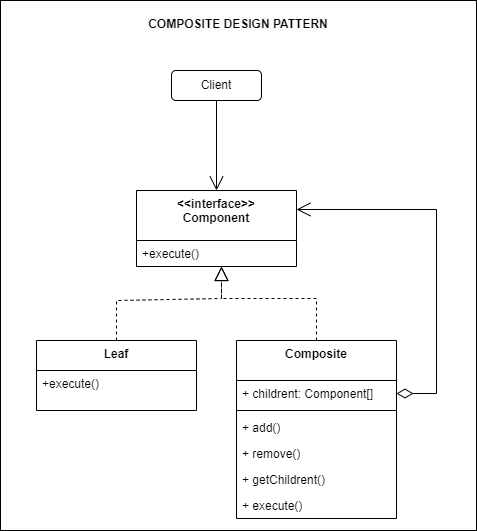

## Source

https://refactoring.guru/design-patterns/composite

### Important:

> 1. Composite is a structural design pattern that lets you compose objects into tree structures and then work with
     these structures as if they were individual objects.
> 2. A tree structure of simple and composite objects

## Description

## Structure



## How to use

1. Use the Composite pattern when you have to implement a tree-like object structure.
2. Use the pattern when you want the client code to treat both simple and complex elements uniformly.

## How to implement

https://refactoring.guru/design-patterns/composite#checklist

## Running

```
python main.py
python example.py
```