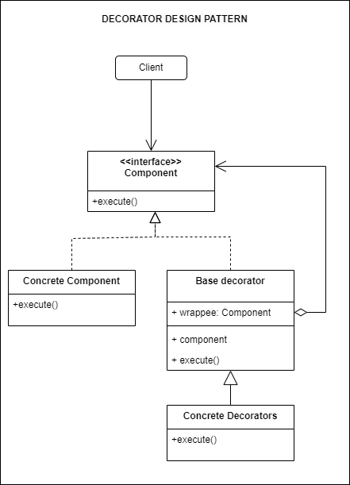

## Source

https://refactoring.guru/design-patterns/decorator

### Important:

> 1. Decorator is a structural design pattern that lets you attach new behaviors to objects by placing these objects
     inside special wrapper objects that contain the behaviors.
> 2. Add responsibilities to objects dynamically

## Description

## Structure



## How to use

1. Use the Decorator pattern when you need to be able to assign extra behaviors to objects at runtime without breaking the code that uses these objects.
2. Use the pattern when it’s awkward or not possible to extend an object’s behavior using inheritance.

## How to implement

https://refactoring.guru/design-patterns/decorator#checklist

## Running

```
python main.py
python example.py
```