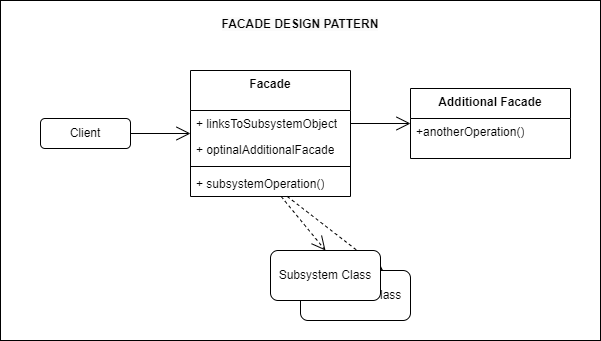

## Source

https://refactoring.guru/design-patterns/decorator

## Cốt lõi:

> Decorator là một mẫu thiết kế cấu trúc cho phép bạn đính kèm các hành vi mới vào các đối tượng bằng cách đặt những đối
> tượng này vào bên trong các đối tượng bọc đặc biệt chứa các hành vi.

## Structure



Các bước tạo một facade

**1. Xác định các thành phần hệ thống:**

- Đầu tiên, bạn cần xác định các thành phần của hệ thống phức tạp mà bạn muốn che giấu đi sự phức tạp của chúng. Điều
  này có thể là một tập hợp các lớp, đối tượng hoặc các thành phần khác của hệ thống.

**2. Tạo một lớp Facade:**

- Tạo một lớp Facade mới, đóng vai trò là một giao diện thống nhất cho các thành phần của hệ thống. Lớp Facade này sẽ
  chứa các phương thức để tương tác với các thành phần hệ thống.

**3. Xác định các phương thức Facade:**

- Xác định các phương thức trong lớp Facade để cung cấp các dịch vụ và chức năng cho người sử dụng cuối. Mỗi phương thức
  trong Facade sẽ là một giao diện thống nhất để truy cập các chức năng của các thành phần hệ thống.

**4. Kết nối các thành phần hệ thống:**

- Trong lớp Facade, bạn sẽ tạo các đối tượng hoặc tham chiếu đến các thành phần cụ thể của hệ thống mà bạn muốn che
  giấu đi. Điều này có thể bao gồm việc tạo đối tượng hoặc khởi tạo các đối tượng từ các lớp khác trong hệ thống.

**5. Cài đặt phương thức Facade:**

- Trong các phương thức của lớp Facade, bạn sẽ triển khai mã để gọi các phương thức hoặc chức năng của các thành phần
  hệ thống tương ứng. Lớp Facade sẽ đóng vai trò trung gian giữa người sử dụng và các thành phần hệ thống.

**6. Sử dụng Facade:**

- Khi bạn đã triển khai lớp Facade, người sử dụng có thể sử dụng nó để truy cập các chức năng của hệ thống mà không cần
  quan tâm đến sự phức tạp bên trong.

**7. Kiểm tra và sửa lỗi:**

- Kiểm tra kỹ lưỡng và sửa lỗi trong mẫu thiết kế Facade để đảm bảo rằng nó hoạt động một cách đúng đắn và hiệu quả.

## Description

### Mục đích

Mục đích chính của mẫu thiết kế Facade (Facade Design Pattern) là cung cấp một interface đơn giản và thống nhất cho một
hệ thống phức tạp, giúp che giấu đi sự phức tạp bên trong và cung cấp một cách tiếp cận dễ dàng hơn cho người sử dụng.
Dưới đây là mục đích chính của mẫu thiết kế Facade:

1. **Che giấu sự phức tạp:** Một trong những mục đích quan trọng nhất của Facade là ẩn đi sự phức tạp của hệ thống bên
   trong. Hệ thống có thể được cấu tạo từ nhiều lớp, đối tượng và phương thức khác nhau, và Facade giúp người sử dụng
   không cần phải biết chi tiết cụ thể về cách hệ thống hoạt động.
2. **Giảm sự phụ thuộc:** Facade giúp giảm sự phụ thuộc giữa các thành phần khác nhau của hệ thống. Thay vì các thành phần
   phải tương tác trực tiếp với nhau, chúng tương tác thông qua lớp Facade, điều này làm giảm mức độ phụ thuộc và làm
   cho hệ thống dễ dàng bảo trì và mở rộng.
3. **Cung cấp giao diện thống nhất:** Facade cung cấp một giao diện thống nhất cho người sử dụng để truy cập các chức năng
   của hệ thống. Điều này làm cho việc sử dụng hệ thống trở nên dễ dàng hơn và giúp đảm bảo tính thống nhất trong cách
   người sử dụng tương tác với hệ thống.
4. **Cải thiện tính module và bảo trì:** Mẫu thiết kế Facade giúp tạo ra một lớp trung gian cho các tác vụ phức tạp, giúp dễ
   dàng quản lý mã nguồn và bảo trì hệ thống. Việc thay đổi bên trong hệ thống không cần phải ảnh hưởng đến người sử
   dụng lớp Facade.
5. **Cải thiện sự bảo mật:** Bằng cách che giấu chi tiết cụ thể của hệ thống, Facade có thể giúp kiểm soát quyền truy cập
   đến các chức năng cụ thể và cung cấp một lớp bảo vệ cho hệ thống.

## Khi nào thì sử dụng facade

1. **Khi hệ thống có sự phức tạp:** Khi hệ thống của bạn có nhiều lớp, đối tượng hoặc chức năng phức tạp và bạn muốn
   cung cấp một giao diện đơn giản để che giấu sự phức tạp đó.

2. **Khi bạn muốn giảm sự phụ thuộc:** Khi bạn muốn giảm sự phụ thuộc giữa các thành phần khác nhau của hệ thống, mà
   không cần phải sử dụng trực tiếp các phương thức hoặc lớp của chúng.

3. **Khi bạn muốn tạo một giao diện thống nhất:** Khi bạn muốn cung cấp một giao diện thống nhất cho người sử dụng để
   truy cập các chức năng của hệ thống mà không cần biết chi tiết cụ thể của từng thành phần.

4. **Khi bạn muốn cải thiện tính module và bảo trì:** Mẫu thiết kế Facade giúp tạo ra một lớp trung gian cho các tác vụ
   phức tạp, giúp dễ dàng bảo trì và quản lý mã nguồn.

5. **Khi bạn muốn cải thiện sự bảo mật:** Bằng cách che giấu chi tiết cụ thể của hệ thống, bạn có thể cung cấp một lớp
   bảo vệ để kiểm soát quyền truy cập đến các chức năng cụ thể.

6. **Khi bạn làm việc với một thư viện hoặc framework mà bạn không muốn tiếp xúc trực tiếp:** Trong trường hợp bạn sử
   dụng một thư viện hoặc framework có sự phức tạp, bạn có thể sử dụng Facade để che giấu sự phức tạp của thư viện đó và
   chỉ cung cấp một giao diện dễ sử dụng cho ứng dụng của bạn.

7. **Khi bạn muốn tạo lớp trung gian cho các dịch vụ ngoại vi:** Facade cũng có thể được sử dụng để tạo một lớp trung
   gian cho việc tương tác với các dịch vụ ngoại vi như cơ sở dữ liệu, giao tiếp mạng, hoặc bất kỳ hệ thống ngoại vi nào
   khác

## Running

```
python main.py
python example.py
```