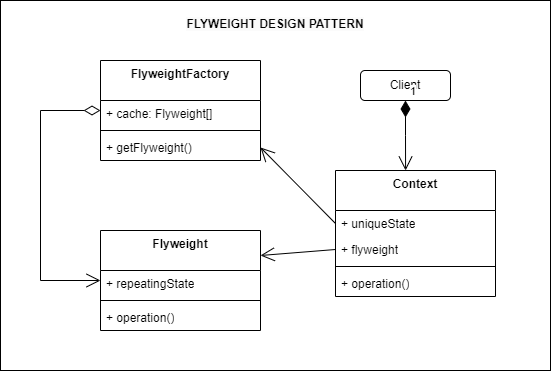

## Source

https://refactoring.guru/design-patterns/flyweight

### Important:

> 1. Flyweight is a structural design pattern that lets you fit more objects into the available amount of RAM by sharing
     common parts of state between multiple objects instead of keeping all of the data in each object.
> 2. A fine-grained instance used for efficient sharing. Also known as: Cache

## Description

## Structure



## How to use

1. Use the Flyweight pattern only when your program must support a huge number of objects which barely fit into available
RAM.

## How to implement

https://refactoring.guru/design-patterns/flyweight#checklist

## Running

```
python main.py
python example.py
```